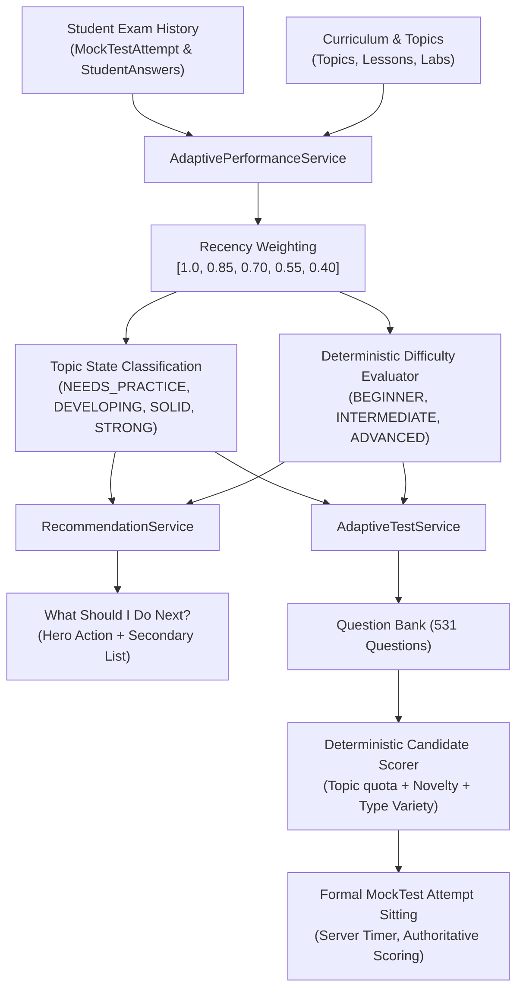

# NexoraNet Adaptive Testing Engine (Step 8)

> **Important Statement:**  
> NexoraNet's adaptive testing and personalized practice engine is currently **deterministic and rule-based**. It does **not** use an external AI model or LLM.

---

## 1. Engine Philosophy & Educational Model

The Adaptive Testing Engine dynamically tailors assessments and practice sessions to a student's demonstrated competencies across computer networking and cybersecurity domains.

It operates along the core platform pedagogy:

$$\text{LEARN} \longrightarrow \text{DO} \longrightarrow \text{OBSERVE} \longrightarrow \text{EXPLAIN} \longrightarrow \text{VALIDATE} \longrightarrow \text{PRACTICE} \longrightarrow \text{TEST} \longrightarrow \text{DEFEND}$$

### Core Design Principles:
1. **Explainability Over Black-Box Claims:**  
   Every recommendation and status label includes an explicit, transparent reason (e.g. *"Your recent IPv4 subnetting accuracy is 58% across 24 questions, so targeted Intermediate subnetting practice is recommended"*).
2. **Neutral Performance States:**  
   The platform never produces permanent labels of student ability or intelligence. Categories such as `NEEDS_PRACTICE`, `DEVELOPING`, `SOLID`, and `STRONG` represent temporary performance states derived from recent data.
3. **Server-Authoritative Evaluation:**  
   All metrics, timers, difficulty recommendations, and question selections are computed strictly on the backend. No client-side assertions or scores are ever trusted.
4. **Zero-Knowledge Information Shielding:**  
   During test sittings, correct answers, options metadata, and explanations are stripped from client payloads, preventing answer key extraction.

---

## 2. Architecture & Service Breakdown

---

## 3. Configuration & Hyperparameters

All algorithm constants and statistical limits are centralized in [`backend/app/core/adaptive_config.py`](file:///c:/Users/himan/Downloads/Projects/antigravity%20NexoraNet/backend/app/core/adaptive_config.py):

| Constant | Value | Description |
| :--- | :---: | :--- |
| `ADAPTIVE_MIN_QUESTIONS` | `5` | Minimum answered questions to escape `INSUFFICIENT_DATA` |
| `ADAPTIVE_PRELIMINARY_LIMIT` | `9` | 5–9 questions: `PRELIMINARY` statistical confidence |
| `ADAPTIVE_DEVELOPING_LIMIT` | `19` | 10–19 questions: `DEVELOPING` confidence; 20+: `STRONG` confidence |
| `ADAPTIVE_RECENT_ATTEMPTS` | `5` | Window of recent completed mock attempts analyzed |
| `ADAPTIVE_RECENT_QUESTION_LIMIT` | `100` | Maximum question responses processed in recent window |
| `ADAPTIVE_NEEDS_PRACTICE_THRESHOLD` | `60.0%` | Recent accuracy $< 60\%$ flags `NEEDS_PRACTICE` |
| `ADAPTIVE_DEVELOPING_THRESHOLD` | `80.0%` | Recent accuracy $60\% - 79.9\%$ flags `DEVELOPING` |
| `ADAPTIVE_SOLID_THRESHOLD` | `90.0%` | Recent accuracy $80\% - 89.9\%$ flags `SOLID` |
| `ADAPTIVE_STRONG_THRESHOLD` | `90.0%` | Recent accuracy $\ge 90\%$ flags `STRONG` |
| `ADAPTIVE_DEFAULT_QUESTION_COUNT` | `20` | Default question volume for dynamically compiled sessions |
| `ADAPTIVE_DEFAULT_DURATION_MINUTES` | `20` | Default exam duration for adaptive sessions |
| `ADAPTIVE_RECENCY_WEIGHTS` | `[1.00, 0.85, 0.70, 0.55, 0.40]` | Chronological weights applied to attempts (index 0 is most recent) |
| `ADAPTIVE_TOPIC_TARGET_DISTRIBUTION` | `50% / 30% / 15% / 5%` | Target topic quota (Needs Practice / Developing / Solid / Strong) |
| `ADAPTIVE_NO_REPEAT_ATTEMPTS_COUNT` | `2` | Questions answered in last 2 attempts are suppressed from reuse |
| `ADAPTIVE_DECAY_DAYS` | `14` | Days without practice before suggesting a `Quick Refresher` review |

---

## 4. Recency Weighting Algorithm

For every topic, raw accuracy is distinguished from **recency-weighted accuracy**:

$$\text{Weighted Accuracy} = \frac{\sum_{i=0}^{N-1} w_i \cdot \text{CorrectAnswers}_i}{\sum_{i=0}^{N-1} w_i \cdot \text{AnsweredQuestions}_i} \times 100$$

Where $w_i = \text{ADAPTIVE\_RECENCY\_WEIGHTS}[i]$.

This guarantees that an early mistake when first learning a protocol does not permanently hold back a student once they demonstrate improvement.

---

## 5. Candidate Question Scoring & Adaptation Rules

Candidate questions are selected using a multi-factor score:

$$\text{CandidateScore} = \text{DifficultyWeight} + \text{NoveltyWeight} + \text{VarietyWeight}$$

1. **Difficulty Weight:**
   - Matching recommended difficulty: `+30.0`
   - Adjacent difficulty (e.g., Intermediate while practicing Beginner): `+15.0`
   - Non-adjacent difficulty: `+5.0`
2. **Novelty Weight:**
   - Question not answered in the last 2 attempts: `+25.0`
   - Question seen in recent attempts: `0.0`
3. **Question Type Variety:**
   - Interactive types (`NUMERICAL`, `SUBNETTING`, `SCENARIO`, `PACKET_ANALYSIS`): `+10.0`
   - Choice types (`SINGLE_CHOICE`, `MULTIPLE_CHOICE`, `TRUE_FALSE`): `+5.0`

### Gradual Transitions:
Difficulty transitions are never aggressive:
$$\text{BEGINNER} \longleftrightarrow \text{INTERMEDIATE} \longleftrightarrow \text{ADVANCED}$$
A single correct response never skips intermediate levels, preventing unstable difficulty spikes.

---

## 6. API Reference

| Endpoint | Method | Response Model | Description |
| :--- | :---: | :---: | :--- |
| `/api/v1/adaptive/overview` | `GET` | `AdaptiveOverviewResponse` | Diagnostic metrics, recommended difficulty, and next actions |
| `/api/v1/adaptive/topic-performance` | `GET` | `list[TopicPerformanceItem]` | Topic status, recent accuracy, and sample size confidence |
| `/api/v1/adaptive/recommendations` | `GET` | `list[RecommendationItem]` | Categorized next step recommendations (Lessons, Labs, Tests, Practice) |
| `/api/v1/adaptive/recommendations/next` | `GET` | `RecommendationItem \| None` | Single highest-priority next step for hero cards |
| `/api/v1/adaptive/events` | `POST` | `{"status": "recorded"}` | Recommendation interaction and telemetry logging |
| `/api/v1/adaptive-tests/start` | `POST` | `StartAttemptResponse` | Dynamically compile and launch an adaptive test sitting |
| `/api/v1/adaptive-tests/{id}` | `GET` | `StartAttemptResponse` | Retrieve sitting questions and order with zero-knowledge shielding |
| `/api/v1/adaptive-tests/{id}/status` | `GET` | `AttemptStatusResponse` | Synchronize server timer and verify expiration state |

---

## 7. Limitations & Future Roadmap

- **Current Scope:** Fully rule-based, deterministic, and privacy-conscious. No third-party LLMs or unpredictable AI agents.
- **Future AI Expansion:** Future iterations (post Step 12) may integrate local, deterministic SLM agents for conversational rationale tutoring without compromising authoritative grading security.
