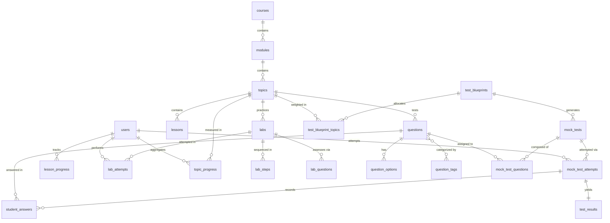

# NexoraNet Database Schema & Relational Design

> Document Version: 1.0.0  
> Migration Baseline: `71f1d55cea91_create_step2_schema`  
> Engine Support: SQLite (Dev) / PostgreSQL (Target Production)

---

## 1. Architectural Principles

The NexoraNet database layer is engineered around strict relational normalization, referential integrity, and engine portability:
1. **Engine Agnostic**: Uses standard ANSI SQL column types (`Integer`, `String`, `Text`, `Boolean`, `Float`, `DateTime`, `Enum`) compatible across SQLite, PostgreSQL, and MySQL without proprietary extensions.
2. **First-Class Foreign Keys**: Explicit foreign keys, relational cascades (`ON DELETE CASCADE`), and referential constraints throughout.
3. **Optimized Indexes**: Strategic composite and single-column indexes on high-frequency lookup paths (`slug`, `(module_id, order_index)`, `(topic_id, order_index)`, `(user_id, status)`).
4. **Universal Topic Pivot**: The `topics` table acts as the unified pivot entity connecting Curriculum lessons, Question Bank items, Lab checkpoints, Mock Test blueprints, and Student progress telemetry.
5. **Timestamped Auditing**: All persistent tables inherit from `TimeStampedModel`, tracking timezone-aware UTC `created_at` and `updated_at`.

---

## 2. Entity-Relationship Diagram (ERD)

---

## 3. Enumerated Types

| Enum Name | Enum Values | Description |
| :--- | :--- | :--- |
| `DifficultyLevel` | `BEGINNER`, `INTERMEDIATE`, `ADVANCED` | Global cognitive and skill rating across all entities. |
| `QuestionType` | `SINGLE_CHOICE`, `MULTIPLE_CHOICE`, `TRUE_FALSE`, `FILL_BLANK`, `NUMERICAL`, `SUBNETTING`, `SCENARIO`, `PACKET_ANALYSIS`, `MATCHING` | Assessment question formats supported by validation and scoring. |
| `CognitiveLevel` | `KNOWLEDGE`, `COMPREHENSION`, `APPLICATION`, `ANALYSIS` | Bloom's Taxonomy classification for question items. |
| `ContentType` | `LESSON`, `ARTICLE`, `DIAGRAM`, `EXAMPLE`, `REFERENCE` | Curriculum lesson rendering mode. |
| `LabStatus` | `DRAFT`, `PUBLISHED`, `ARCHIVED` | Hands-on laboratory lifecycle state. |
| `QuestionStatus` | `DRAFT`, `REVIEW`, `PUBLISHED`, `ARCHIVED` | Editorial question lifecycle state. |
| `MockTestStatus` | `DRAFT`, `PUBLISHED`, `ARCHIVED` | Exam composition readiness state. |
| `AttemptStatus` | `IN_PROGRESS`, `SUBMITTED`, `EXPIRED`, `ABANDONED` | Student exam / lab session state. |
| `UserRole` | `STUDENT`, `INSTRUCTOR`, `ADMIN` | Role-based authorization tier. |
| `ProgressStatus`| `NOT_STARTED`, `IN_PROGRESS`, `COMPLETED` | Granular student progression milestones. |

---

## 4. Table Specifications

### 4.1 Users & Identity
#### `users`
* `id` (`Integer`, PK, autoincrement)
* `username` (`String(50)`, unique, index, not null)
* `email` (`String(255)`, unique, index, not null)
* `password_hash` (`String(255)`, not null) — Argon2/bcrypt digest (no plaintext passwords)
* `display_name` (`String(100)`, not null)
* `current_level` (`Enum(DifficultyLevel)`, default: `BEGINNER`)
* `role` (`Enum(UserRole)`, default: `STUDENT`)
* `is_active` (`Boolean`, default: `True`)
* `created_at`, `updated_at` (`DateTime(timezone=True)`)

---

### 4.2 Curriculum Hierarchy
#### `courses`
* `id` (`Integer`, PK)
* `title` (`String(150)`, not null)
* `slug` (`String(150)`, unique, index, not null)
* `description` (`Text`)
* `level` (`Enum(DifficultyLevel)`, default: `BEGINNER`)
* `estimated_hours` (`Integer`, default: 40)
* `is_published` (`Boolean`, default: `True`)

#### `modules`
* `id` (`Integer`, PK)
* `course_id` (`Integer`, FK -> `courses.id`, ondelete: CASCADE, index)
* `title` (`String(150)`, not null)
* `slug` (`String(150)`, not null)
* `description` (`Text`)
* `order_index` (`Integer`, default: 0)
* `difficulty` (`Enum(DifficultyLevel)`, default: `BEGINNER`)
* `is_published` (`Boolean`, default: `True`)
* **Constraints**: Unique `(course_id, slug)`

#### `topics` (Global Knowledge Pivot)
* `id` (`Integer`, PK)
* `module_id` (`Integer`, FK -> `modules.id`, ondelete: CASCADE, index)
* `title` (`String(150)`, not null)
* `slug` (`String(150)`, not null)
* `description` (`Text`)
* `difficulty` (`Enum(DifficultyLevel)`, default: `BEGINNER`)
* `order_index` (`Integer`, default: 0)
* `is_published` (`Boolean`, default: `True`)
* **Constraints**: Unique `(module_id, slug)`

#### `lessons`
* `id` (`Integer`, PK)
* `topic_id` (`Integer`, FK -> `topics.id`, ondelete: CASCADE, index)
* `title` (`String(150)`, not null)
* `slug` (`String(150)`, not null)
* `description` (`Text`)
* `content` (`Text`, not null) — Markdown payload
* `content_type` (`Enum(ContentType)`, default: `LESSON`)
* `order_index` (`Integer`, default: 0)
* `estimated_minutes` (`Integer`, default: 15)
* `difficulty` (`Enum(DifficultyLevel)`, default: `BEGINNER`)
* `is_published` (`Boolean`, default: `True`)
* **Constraints**: Unique `(topic_id, slug)`

---

### 4.3 Practical Labs
#### `labs`
* `id` (`Integer`, PK)
* `topic_id` (`Integer`, FK -> `topics.id`, ondelete: CASCADE, index)
* `title` (`String(150)`, not null)
* `slug` (`String(150)`, unique, index, not null)
* `description` (`Text`)
* `difficulty` (`Enum(DifficultyLevel)`, default: `BEGINNER`)
* `estimated_minutes` (`Integer`, default: 30)
* `status` (`Enum(LabStatus)`, default: `DRAFT`)
* `environment_type` (`String(50)`, default: `"container"`)
* `setup_script` (`Text`)
* `verification_script` (`Text`)

#### `lab_steps`
* `id` (`Integer`, PK)
* `lab_id` (`Integer`, FK -> `labs.id`, ondelete: CASCADE, index)
* `step_number` (`Integer`, not null)
* `title` (`String(150)`, not null)
* `instruction` (`Text`, not null)
* `hint` (`Text`)
* `expected_output` (`Text`)
* `validation_command` (`String(255)`)
* **Constraints**: Unique `(lab_id, step_number)`

#### `lab_questions`
* `id` (`Integer`, PK)
* `lab_id` (`Integer`, FK -> `labs.id`, ondelete: CASCADE, index)
* `step_number` (`Integer`)
* `prompt` (`Text`, not null)
* `expected_answer` (`String(255)`, not null)
* `points` (`Integer`, default: 10)

---

### 4.4 Question Bank & Tagging
#### `questions`
* `id` (`Integer`, PK)
* `topic_id` (`Integer`, FK -> `topics.id`, ondelete: RESTRICT, index)
* `title` (`String(255)`, not null)
* `prompt` (`Text`, not null)
* `question_type` (`Enum(QuestionType)`, not null)
* `difficulty` (`Enum(DifficultyLevel)`, not null)
* `cognitive_level` (`Enum(CognitiveLevel)`, default: `COMPREHENSION`)
* `explanation` (`Text`, not null) — *Protected student shield*
* `hint` (`Text`)
* `points` (`Integer`, default: 1)
* `status` (`Enum(QuestionStatus)`, default: `PUBLISHED`, index)

#### `question_options`
* `id` (`Integer`, PK)
* `question_id` (`Integer`, FK -> `questions.id`, ondelete: CASCADE, index)
* `option_key` (`String(10)`, not null) — e.g. "A", "B", "C", "D"
* `option_text` (`Text`, not null)
* `is_correct` (`Boolean`, not null) — *Protected student shield*
* `explanation` (`Text`)
* `order_index` (`Integer`, default: 0)

#### `question_tags` & Association
* `question_tags`: `id`, `name` (unique), `slug` (unique, index), `description`
* `question_tags_association`: Composite PK `(question_id, tag_id)` linking `questions.id` and `question_tags.id` with cascade deletion.

---

### 4.5 Mock Tests, Blueprints & Student Attempts
#### `test_blueprints` & `test_blueprint_topics`
* `test_blueprints`: `id`, `title`, `slug` (unique), `description`, `target_difficulty`, `total_questions`, `time_limit_minutes`, `passing_percentage`, `is_active`
* `test_blueprint_topics`: `id`, `blueprint_id` (FK), `topic_id` (FK), `question_count` (int), `weight_percentage` (float)

#### `mock_tests` & `mock_test_questions`
* `mock_tests`: `id`, `blueprint_id` (FK, nullable), `title`, `slug` (unique), `description`, `difficulty`, `time_limit_minutes`, `passing_percentage`, `status`, `total_points`
* `mock_test_questions`: `id`, `mock_test_id` (FK), `question_id` (FK), `order_index`, `points_override` (nullable)

#### `mock_test_attempts`, `student_answers` & `test_results`
* `mock_test_attempts`: `id`, `user_id` (FK), `mock_test_id` (FK), `status` (`AttemptStatus`), `started_at`, `submitted_at`, `time_spent_seconds`
* `student_answers`: `id`, `attempt_id` (FK), `question_id` (FK), `selected_option_ids` (`JSON`), `text_answer` (`Text`), `is_correct` (`Boolean`), `points_awarded` (`Float`)
* `test_results`: `id`, `attempt_id` (FK, unique), `user_id` (FK), `total_questions`, `correct_answers`, `incorrect_answers`, `score_percentage`, `is_passed`, `topic_breakdown` (`JSON`), `generated_at`

---

### 4.6 Progress Tracking & Analytics
* `lesson_progress`: `(user_id, lesson_id)` composite unique tracking `status`, `completed_at`, `time_spent_seconds`.
* `lab_attempts`: `(user_id, lab_id)` sessions tracking `status`, `score`, `started_at`, `completed_at`.
* `topic_progress`: `(user_id, topic_id)` composite unique aggregating `proficiency_score`, `lessons_completed`, `labs_completed`, `questions_attempted`, `questions_correct`, `last_practiced_at`.
