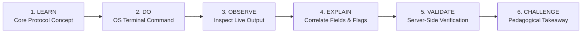
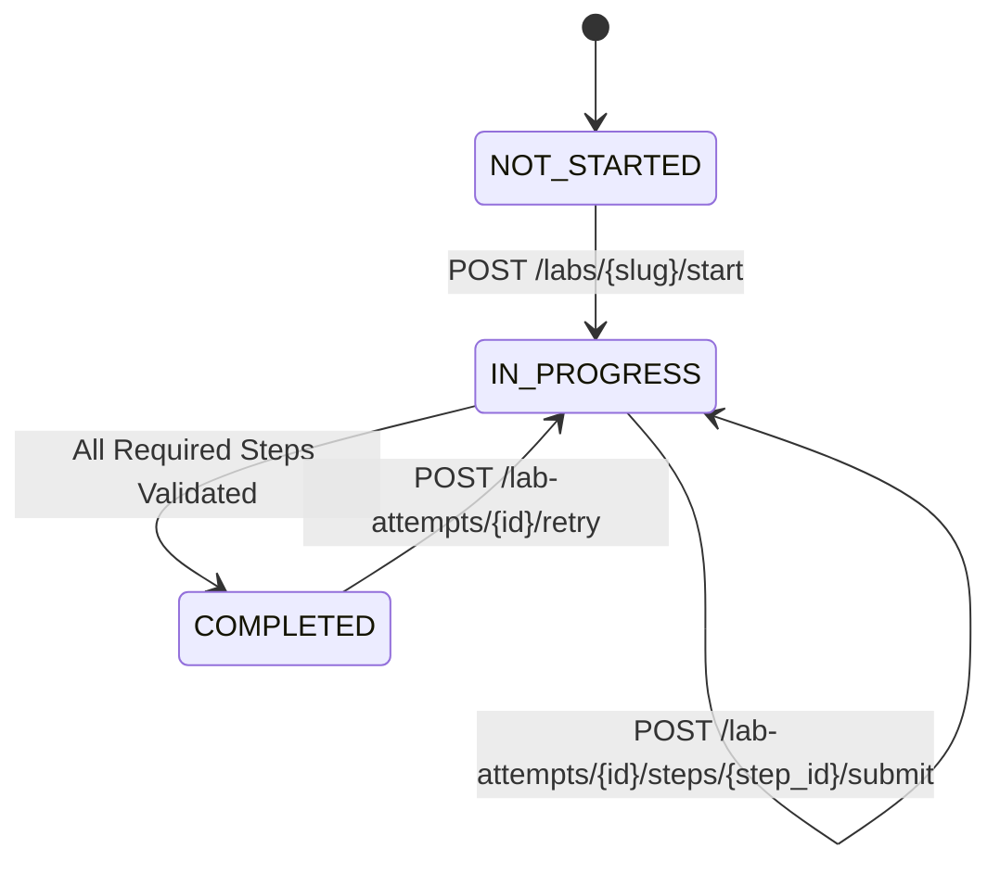

# NexoraNet Hands-on Networking Lab Engine

> **Tagline**: *"Learn. Simulate. Analyze. Defend."*  
> **Phase**: Step 4 — Hands-on Networking Lab Engine

---

## 1. Engine Philosophy & Pedagogical Framework

The NexoraNet Lab Engine is designed to bridge the critical gap between conceptual networking theory and terminal-level operational muscle memory. Rather than passively reading abstract networking protocols, students navigate a rigorous experiential cycle:



1. **LEARN**: Concise theoretical primer explaining what parameter is being queried and why it matters to network operation and defense.
2. **DO**: Platform-adaptive CLI execution instructions (Windows CMD / PowerShell, Linux Bash / Zsh, macOS Terminal) executed directly on the student's workstation.
3. **OBSERVE**: Concrete markers to identify in output (e.g. `IPv4 Address`, `Subnet Mask`, `Default Gateway`, `inet`, `LISTEN`).
4. **EXPLAIN & ANSWER**: Student enters their verified observation into specialized, validated input components.
5. **VALIDATE**: Server validates observations with zero-knowledge answer shielding, preventing inspection of answer keys prior to submission.
6. **CHALLENGE**: System delivers immediate pedagogical feedback, awards server-calculated points, and unlocks defensive context.

---

## 2. Safety Architecture (Zero Server Command Execution)

A fundamental security tenet of NexoraNet is **strict host isolation**:

* **No Arbitrary Server-Side Command Execution**: The backend server **never** invokes shell commands or sub-processes from student input.
* **Client-Side Safe Workstation Drills**: In `LOCAL_SYSTEM` drills, students run read-only network inspection utilities (`ipconfig`, `ip addr`, `netstat -ano`, `ss -tuln`, `route print`, `ip route`, `ping 127.0.0.1`, `nslookup`) directly in their own local operating system terminal.
* **Strict Schema Sanitization**: All incoming submission payloads pass through rigorous Pydantic schemas and typed validators (`IPAddress`, `CIDR`, `SubnetMask`, `PortNumber`, `SingleChoice`).

---

## 3. Environment Types & Extensibility Roadmap

The database architecture and validation engine support 6 pluggable environment types via `LabEnvironmentType`:

| Environment Type | Status | Description |
|:---|:---:|:---|
| `LOCAL_SYSTEM` | **Active** | Workstation-native terminal inspection drills (`ipconfig`, `ip addr`, `ss`, `ping`, `nslookup`). |
| `CONCEPTUAL` | **Active** | Interactive theory drills (subnet boundaries, TCP vs UDP tradeoffs, handshake state transitions). |
| `CONTAINER` | *Planned* | Isolated Docker container sandboxes for virtual routing, bridges, and iptables rules. |
| `PCAP` | *Planned* | Wireshark and tshark packet capture dissection with protocol timeline filters. |
| `SIMULATOR` | *Planned* | Interactive packet routing simulator with customizable nodes, switches, and routers. |
| `LOG_ANALYSIS` | *Planned* | Zeek, Suricata, and firewall log triage for incident detection. |

---

## 4. Zero-Knowledge Answer Shielding

To protect educational integrity and prevent client-side answer sniffing:

* When a student requests lab details or step questions (`GET /api/v1/labs/{id}`), the backend strips all sensitive validation keys (`correct_answer`, `correct_options`, `regex_pattern`, `target_ip`, `target_port`, `explanation`).
* The client only receives a sanitized `safe_input_config`:
  ```json
  {
    "validation_type": "IP_ADDRESS",
    "placeholder": "192.168.1.100",
    "helper_text": "Enter your verified local IPv4 address"
  }
  ```
* For choice-based questions, only randomized option text labels are returned, never index identifiers or boolean answer flags.
* Explanations and answer verifications are returned **only after** a submission has been validated on the server.

---

## 5. Attempt Lifecycle & Idempotent Scoring

Every lab session operates under strict state machine rules:



* **Idempotent Step Submissions**: Re-submitting an already-passed step recalculates the score without double-counting points.
* **Best-Effort History Preservation**: Previous submission history is preserved with timestamps, hint usage flags, and score records.
* **Retry Capability**: Calling `POST /lab-attempts/{id}/retry` archives the attempt, resets step completion states, and starts a fresh attempt counter.
* **Live Telemetry Aggregation**: Real-time stats across all curriculum tiers (total labs, completed labs, average score, beginner/intermediate completion ratios) are computed dynamically via `GET /api/v1/labs/telemetry`.

---

## 6. Seeded Curriculum Labs

NexoraNet Step 4 delivers **22 labs** (18 published, 4 draft):

### Beginner Tier (10 Labs)
1. `find-your-local-ipv4-address` — Locate active host interface and IPv4 configuration.
2. `identify-network-interfaces` — Enumerate loopback, physical ethernet, and wireless adapters.
3. `find-mac-address` — Identify Layer 2 IEEE 802 hardware MAC address and OUI vendor prefix.
4. `inspect-default-gateway` — Trace the first-hop default gateway router.
5. `inspect-host-routing-table` — Analyze the local operating system IP routing table (`0.0.0.0/0`).
6. `perform-dns-lookup` — Resolve domain names to IP addresses with `nslookup`.
7. `verify-localhost-connectivity` — Test loopback TCP/IP stack functionality (`127.0.0.1`).
8. `inspect-listening-ports` — Enumerate active listening sockets and bound network services.
9. `compare-ipv4-and-ipv6-addresses` — Dissect link-local IPv6 (`fe80::/10`) vs IPv4 dotted-decimal.
10. `map-host-network-profile` — Synthesize complete host network fingerprint.

### Intermediate Tier (8 Labs)
11. `calculate-subnet-boundaries` — Calculate subnet masks, prefix lengths, and host counts.
12. `find-network-and-broadcast-range` — Compute network address, broadcast address, and valid host range.
13. `tcp-vs-udp-service-mapping` — Evaluate transport protocol tradeoffs for DNS, HTTP, VoIP, and TFTP.
14. `trace-tcp-3-way-handshake` — Analyze SYN, SYN-ACK, and ACK state transitions.
15. `recursive-dns-resolution-walkthrough` — Map recursive resolver and authoritative nameserver delegations.
16. `http-request-response-headers` — Analyze HTTP methods, status codes, headers, and MIME content.
17. `longest-prefix-match-routing` — Compute router next-hop selection using CIDR prefix priority.
18. `defensive-firewall-rules-acl` — Construct ingress packet filtering rules and stateful tracking.

### Advanced Tier (4 Planned Architectural Blueprints)
19. `analyze-suspicious-pcap-beaconing` (PCAP)
20. `linux-network-namespace-bridge` (Container)
21. `soc-alert-triage-brute-force` (Log Analysis)
22. `configure-ospf-routed-topology` (Simulator)
