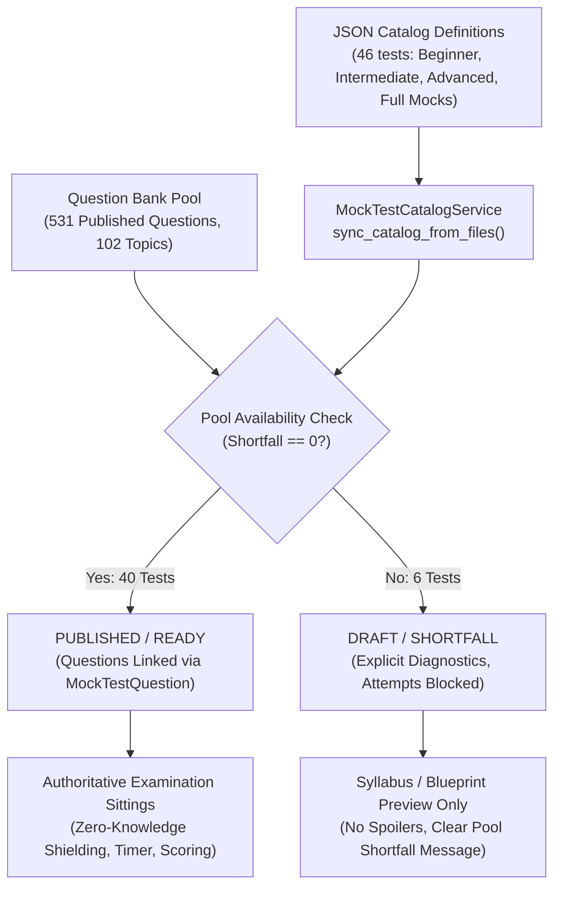

# NexoraNet Mock Test Catalog & Test Library System (Step 7)

## Overview & Architecture

The **Mock Test Catalog & Test Library System** turns the Step 5 Core Mock Test Engine and the Step 6 Comprehensive 531-Question Bank into a structured, production-ready examination catalog. Students can browse, filter, inspect, and sit for 46 structured networking and cybersecurity assessments.

---

## 1. Catalog Structure & Examination Coverage

The catalog organizes 46 examinations across 4 distinct learning tiers:

### 1.1 Beginner Track (14 Examinations)
| Code | Title | Type | Duration | Questions | Passing % | Status |
| :--- | :--- | :--- | :--- | :--- | :--- | :--- |
| `BEGINNER-NETWORKING-001` | Networking Fundamentals | TOPIC | 20 mins | 20 | 70% | **READY** |
| `BEGINNER-OSI-001` | OSI 7-Layer Reference Model | TOPIC | 20 mins | 20 | 70% | **READY** |
| `BEGINNER-TCPIP-001` | TCP/IP Protocol Suite Basics | TOPIC | 15 mins | 15 | 70% | **READY** |
| `BEGINNER-DEVICES-001` | Network Devices & Infrastructure | TOPIC | 15 mins | 15 | 70% | **READY** |
| `BEGINNER-ETHERNET-001` | Ethernet & MAC Addressing | TOPIC | 15 mins | 12 | 70% | **READY** |
| `BEGINNER-IPV4-001` | IPv4 Addressing Fundamentals | TOPIC | 20 mins | 20 | 70% | **READY** |
| `BEGINNER-PRIV-PUB-IP-001` | Public vs Private IP Addresses | TOPIC | 15 mins | 12 | 70% | **READY** |
| `BEGINNER-PORTS-001` | Standard Ports & Protocols | TOPIC | 20 mins | 20 | 70% | **READY** |
| `BEGINNER-DNS-001` | DNS Fundamentals & Name Resolution | TOPIC | 20 mins | 20 | 70% | **DRAFT** (Pool Shortfall: 13) |
| `BEGINNER-DHCP-001` | DHCP & Dynamic Host Configuration | TOPIC | 20 mins | 20 | 70% | **DRAFT** (Pool Shortfall: 18) |
| `BEGINNER-TCP-UDP-001` | TCP & UDP Transport Mechanics | TOPIC | 15 mins | 10 | 70% | **READY** |
| `BEGINNER-HTTP-001` | HTTP, HTTPS & Web Communication | TOPIC | 15 mins | 10 | 70% | **READY** |
| `BEGINNER-SECURITY-001` | Basic Network Security & Threat Defense | TOPIC | 20 mins | 20 | 70% | **READY** |
| `BEGINNER-COMPREHENSIVE-001` | Beginner Comprehensive Networking Exam | COMPREHENSIVE | 35 mins | 30 | 75% | **READY** |

### 1.2 Intermediate Track (16 Examinations)
| Code | Title | Type | Duration | Questions | Passing % | Status |
| :--- | :--- | :--- | :--- | :--- | :--- | :--- |
| `INTERMEDIATE-SUBNET-001` | IPv4 Subnetting Mastery | TOPIC | 30 mins | 25 | 70% | **READY** |
| `INTERMEDIATE-CIDR-001` | CIDR & Variable Length Subnet Masking (VLSM) | TOPIC | 25 mins | 18 | 70% | **READY** |
| `INTERMEDIATE-TCP-UDP-001` | TCP & UDP Transport Protocol Mechanics | TOPIC | 30 mins | 25 | 70% | **READY** |
| `INTERMEDIATE-DNS-DHCP-001` | DNS & DHCP Network Services | TOPIC | 20 mins | 14 | 70% | **READY** |
| `INTERMEDIATE-WEB-001` | HTTP, HTTPS & TLS Encryption | TOPIC | 20 mins | 15 | 70% | **READY** |
| `INTERMEDIATE-ROUTING-001` | Routing Principles & Protocol Concepts | TOPIC | 20 mins | 15 | 70% | **READY** |
| `INTERMEDIATE-SWITCHING-001` | Switching Mechanics & MAC Learning | TOPIC | 20 mins | 15 | 70% | **READY** |
| `INTERMEDIATE-VLAN-001` | VLAN Segmentation & Trunking | TOPIC | 15 mins | 10 | 70% | **READY** |
| `INTERMEDIATE-ARP-ICMP-001` | ARP & ICMP Diagnostic Protocols | TOPIC | 15 mins | 10 | 70% | **READY** |
| `INTERMEDIATE-NAT-001` | NAT & Port Address Translation (PAT) | TOPIC | 15 mins | 8 | 70% | **READY** |
| `INTERMEDIATE-TROUBLESHOOT-001` | Network Troubleshooting & CLI Tools | TOPIC | 20 mins | 15 | 75% | **READY** |
| `INTERMEDIATE-SECURITY-001` | Intermediate Network Defense & ACLs | TOPIC | 20 mins | 14 | 70% | **READY** |
| `INTERMEDIATE-FIREWALLS-001` | Firewalls & Rule Evaluation | TOPIC | 15 mins | 10 | 70% | **READY** |
| `INTERMEDIATE-IDS-001` | IDS & IPS Intrusion Detection | TOPIC | 25 mins | 20 | 70% | **DRAFT** (Pool Shortfall: 19) |
| `INTERMEDIATE-PACKET-001` | Packet Analysis Fundamentals | TOPIC | 25 mins | 20 | 70% | **DRAFT** (Pool Shortfall: 18) |
| `INTERMEDIATE-COMPREHENSIVE-001` | Intermediate Comprehensive Networking Exam | COMPREHENSIVE | 40 mins | 35 | 75% | **READY** |

### 1.3 Advanced Track (13 Examinations)
| Code | Title | Type | Duration | Questions | Passing % | Status |
| :--- | :--- | :--- | :--- | :--- | :--- | :--- |
| `ADVANCED-TCPIP-001` | Advanced TCP/IP & Protocol Forensics | TOPIC | 25 mins | 20 | 75% | **READY** |
| `ADVANCED-SUBNET-001` | Advanced Subnetting & Carrier Routing | TOPIC | 30 mins | 25 | 75% | **DRAFT** (Pool Shortfall: 23) |
| `ADVANCED-ROUTING-SWITCHING-001` | Routing & Switching Security Analysis | TOPIC | 30 mins | 25 | 75% | **DRAFT** (Pool Shortfall: 13) |
| `ADVANCED-SEC-DEFENSE-001` | Advanced Network Security & Defense Architecture | TOPIC | 25 mins | 20 | 75% | **READY** |
| `ADVANCED-PCAP-001` | Packet Analysis & Wireshark Stream Forensics | TOPIC | 35 mins | 25 | 75% | **READY** |
| `ADVANCED-TRAFFIC-001` | Traffic Analysis & Network Baselining | TOPIC | 20 mins | 15 | 75% | **READY** |
| `ADVANCED-IDS-IPS-001` | IDS / IPS Analysis & Evasion Techniques | TOPIC | 20 mins | 15 | 75% | **READY** |
| `ADVANCED-DETECTION-001` | Network Detection Engineering | TOPIC | 25 mins | 20 | 75% | **READY** |
| `ADVANCED-IOC-001` | Network Indicators & Telemetry Corroboration | TOPIC | 25 mins | 20 | 75% | **READY** |
| `ADVANCED-RECON-001` | Network Reconnaissance & Port Scan Detection | TOPIC | 30 mins | 25 | 75% | **READY** |
| `ADVANCED-INCIDENT-001` | Incident Investigation & Network Evidence | TOPIC | 25 mins | 20 | 75% | **READY** |
| `ADVANCED-SOC-001` | SOC Network Analysis & Alert Triage | TOPIC | 25 mins | 20 | 75% | **READY** |
| `ADVANCED-COMPREHENSIVE-001` | Advanced Comprehensive Cyber Defense Exam | COMPREHENSIVE | 45 mins | 35 | 80% | **READY** |

### 1.4 Full Certification Mock Exams (3 Examinations)
| Code | Title | Type | Duration | Questions | Passing % | Status |
| :--- | :--- | :--- | :--- | :--- | :--- | :--- |
| `FULL-MOCK-001` | Full Networking Mock Exam | FULL_MOCK | 60 mins | 50 | 70% | **READY** |
| `FULL-MOCK-002` | Full Networking Security Mock Exam | FULL_MOCK | 60 mins | 50 | 70% | **READY** |
| `FULL-MOCK-003` | Full Networking + Security Comprehensive Exam | FULL_MOCK | 75 mins | 60 | 75% | **READY** |

---

## 2. Pool Availability & Readiness Diagnostics

In accordance with strict assessment integrity standards:
1. **Ready Examinations (`PUBLISHED`, `is_ready: true`)**: The question bank pool contains sufficient published questions for every single rule in the blueprint. Questions are allocated deterministically to `MockTestQuestion` so that all students sitting for the test receive a balanced, syllabus-compliant set of questions.
2. **Draft Examinations (`DRAFT`, `is_ready: false`)**: If any blueprint rule has a question pool shortfall, the test remains in `DRAFT` status. Students can inspect the syllabus, learning objectives, and shortfall diagnostics, but cannot launch exam attempts until authors stage additional questions (raising an HTTP 400 Bad Request error if an attempt is triggered).

### CLI Verification Tools
- `scripts/validate_mock_test_catalog.py`: Validates schema, uniqueness of codes and slugs, blueprint rules, and produces an executive availability table.
- `scripts/seed_mock_test_catalog.py`: Idempotently synchronizes `backend/data/mock_tests/*.json` files into the database.

---

## 3. Database Schema Extensions

Applied via Alembic migration `2026_09_30_0905-f19a8b2c4e33_add_step7_mock_test_catalog_columns.py`:
- `code: String(64), unique, indexed` — Formatted industrial identifier (e.g. `BEGINNER-NETWORKING-001`).
- `blueprint_id: Integer, ForeignKey("test_blueprints.id", ondelete="SET NULL"), indexed`.
- `prerequisites: Text` — Conceptual background recommended prior to sitting.
- `tags: String(255)` — Categorical keywords for taxonomy search.
- `blueprint: relationship("TestBlueprint", backref="mock_tests")`.

---

## 4. API Endpoints

All routes prefixed with `/api/v1/mock-tests`:

| Method | Endpoint | Description |
| :--- | :--- | :--- |
| `GET` | `/api/v1/mock-tests` | Filter catalog by category, difficulty, test_type, topic, duration range, status, or search query. Returns readiness indicators and active sitting ID. |
| `GET` | `/api/v1/mock-tests/categories` | Predefined catalog domains with live test counts. |
| `GET` | `/api/v1/mock-tests/topics` | Unique topics covered across catalog examinations with test counts. |
| `GET` | `/api/v1/mock-tests/difficulties` | Difficulties (`BEGINNER`, `INTERMEDIATE`, `ADVANCED`, `MIXED`) with counts. |
| `GET` | `/api/v1/mock-tests/types` | Test types (`TOPIC`, `DIFFICULTY`, `MIXED`, `COMPREHENSIVE`, `PRACTICE`, `FULL_MOCK`) with counts. |
| `GET` | `/api/v1/mock-tests/filter-options` | Aggregated filter options for fast single-call UI hydration. |
| `GET` | `/api/v1/mock-tests/statistics` | Aggregate catalog metrics (total tests, ready tests, draft tests, questions represented). |
| `GET` | `/api/v1/mock-tests/{id}/preview` | Zero-knowledge safe preview (shows syllabus distribution without question/option spoilers). |
| `GET` | `/api/v1/mock-tests/{id}/blueprint` | Associated syllabus blueprint specification and rules. |
| `GET` | `/api/v1/mock-tests/{id}/attempt-history` | Chronological attempts for this specific examination by current user. |
| `GET` | `/api/v1/mock-tests/{id}` | Complete examination details, instructions, and syllabus breakdown. |
| `POST` | `/api/v1/mock-tests/{id}/start` | Start sitting or resume active sitting. Validates pool readiness (`HTTP 400` if draft). Supports `retake=true`. |

---

## 5. UI Features & Student Workflow

1. **Catalog Browsing (`/mock-tests`)**:
   - Domain Category Tabs (All Tests, Recommended Practice, Beginner, Intermediate, Advanced, Comprehensive, Full Mocks).
   - High-yield **Recommended Starting Track** highlighting core foundational exams.
   - Comprehensive multi-attribute filtering (Difficulty, Test Type, Covered Topic, Duration, Readiness Status, Search).
   - State-aware `MockTestCard`:
     - Displays formatted industrial `code` badge.
     - Readiness indicators (`Ready to Attempt` vs `Draft (Pool Shortfall: N)`).
     - State-aware action buttons:
       - **Continue Sitting**: Pulsing amber badge and direct button if user has an unexpired sitting.
       - **Retake**: Creates fresh attempt preserving prior records.
       - **View Test / View Syllabus**: Details and syllabus breakdown.
2. **Examination Details (`/mock-tests/:slug`)**:
   - Examination metrics grid (Time limit, Question count, Passing standard, Last score).
   - Shortfall alert box for draft examinations.
   - "What You Will Practice" bulleted competencies.
   - Pre-test guidelines explaining authoritative server clock, zero-knowledge shielding, free palette navigation, and mark-for-review.
   - Syllabus topic distribution card.
   - **Sitting History Table**: Displays previous sittings with dates, scores, pass/fail status, and direct links to result reviews.

---

## 6. Strict Scope & Boundaries

In accordance with Step 7 architectural boundaries:
- **No Step 8 Adaptive Testing**: All recommendations are simple, non-adaptive curriculum groupings. No AI dynamic difficulty or automated personalized pacing was added.
- **No Step 9 Network Simulator**: No virtual topologies, packet injectors, or visual canvas simulator components were created.
- **No Step 10 PCAP Analyzer**: No backend packet dissector or web PCAP visualizer was introduced.
- **No Step 11 Detection / Mini SOC**: No alert queues, Sigma engines, or SIEM triage consoles were introduced.
- **No Global Leaderboards**: Sitting history remains isolated per student with zero competitive scoreboards.
