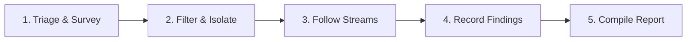

# NexoraNet — Guided Packet Investigation & SOC Forensics

## Investigation Methodology

The NexoraNet packet analysis workspace follows an evidence-based forensic methodology modeled on Tier 1 / Tier 2 Security Operations Center (SOC) workflows:

---

## 5-Step SOC Analysis Workflow

### Step 1: Initial Triage & Overview
- Inspect **Capture Statistics** to understand macro metrics:
  - Total packets and total data volume
  - Packet transmission rate (pps) and burst timeline
  - Protocol breakdown: Is the capture dominated by TCP, UDP, or unexpected ICMP?
  - Top Talkers: Identify which IP addresses are generating the highest volume.

### Step 2: Protocol Filtering & Anomaly Identification
- Use the **Display Filter Bar** to isolate specific traffic classes:
  - Examine DNS queries (`dns`) to spot unusual domains or excessive NXDOMAIN responses.
  - Inspect connection attempts (`tcp.flags.syn && !tcp.flags.ack`) to see if an endpoint is probing multiple ports.
  - Review **Automated Observations** flagged by the heuristic engine.

### Step 3: Stream Reassembly & Flow Ladder Inspection
- Switch to the **Conversations & Flows** tab to view communication sessions.
- Examine the **TCP Handshake State**:
  - `COMPLETE`: Normal 3-way handshake indicates mutual communication.
  - `INCOMPLETE`: Half-open connection indicates an unanswered probe or packet drop.
  - `RESET`: Connection terminated prematurely, often indicating closed ports or firewall rejection.
- Follow the sequence ladder to analyze packet-by-packet turn taking between client and server.

### Step 4: Evidence Bookmarking & Note Taking
- Flag noteworthy packets using the bookmark toggle in the packet table.
- Attach specific analytical tags (e.g. `#syn_scan`, `#dns_nxdomain`, `#web_admin`).
- Record working hypotheses in the **Analyst Notes** notepad (e.g., *"Host 10.0.0.5 is querying external resolvers directly instead of using internal gateway 10.0.0.1"*).

### Step 5: Formulating Findings & Reporting
- Formulate a formal finding in the **Investigation Workspace**:
  - **Title**: Descriptive summary of the observation.
  - **Severity**: `INFO`, `LOW`, `MEDIUM`, or `HIGH`.
  - **Hypothesis**: Initial assumption regarding the traffic behavior.
  - **Conclusion**: Evidence-supported evaluation and recommended remediation.
  - **Evidence Packets**: Explicit packet numbers linking the finding directly to captured data.
- Click **View SOC Report** or **Export JSON** to generate an executive forensic briefing document.
