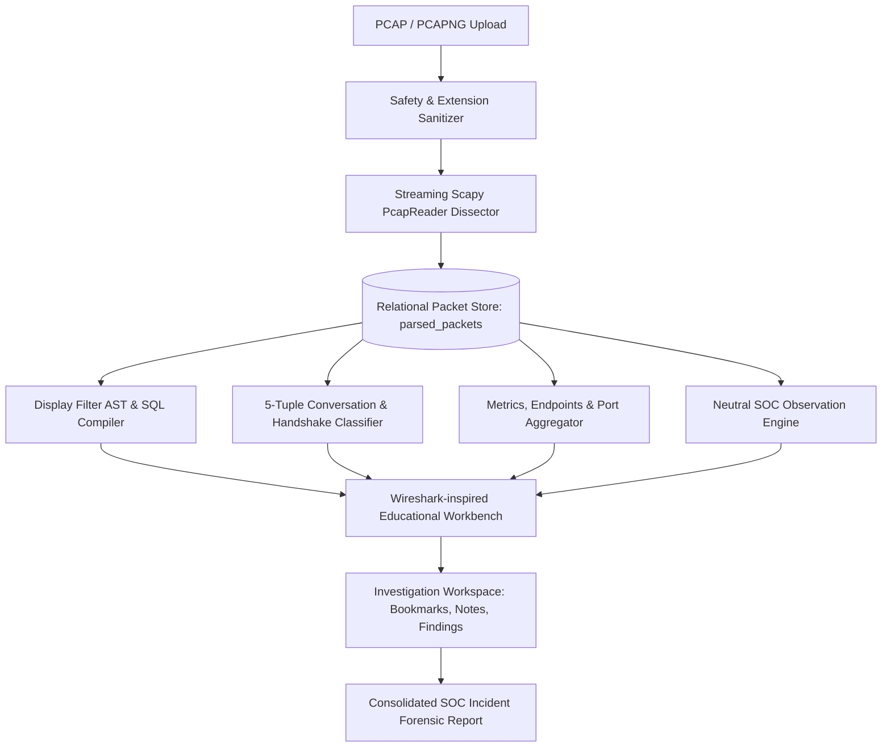

# NexoraNet — PCAP & Packet Analysis Engine

## Overview & Pedagogical Purpose

The **NexoraNet PCAP & Packet Analysis Engine** (Step 10) provides an offline, defensive packet inspection and network forensics workbench. Designed for networking students and aspiring Security Operations Center (SOC) analysts, the system teaches students how to deconstruct real-world packet captures without live transmission, raw socket emission, or remote exploitation.

The module follows the platform's core learning pedagogy:
$$\text{LEARN} \longrightarrow \text{DO} \longrightarrow \text{OBSERVE} \longrightarrow \text{EXPLAIN} \longrightarrow \text{VALIDATE} \longrightarrow \text{PRACTICE} \longrightarrow \text{TEST} \longrightarrow \text{DEFEND}$$

---

## Architectural Components

---

## System Capabilities

1. **Multi-Format Ingestion**:
   - Parses `.pcap`, `.pcapng`, and `.cap` capture formats.
   - Enforces a 50 MB file size limit and strict extension whitelisting.
   - Streaming architecture parses files chunk-by-chunk without loading multi-gigabyte captures into memory.

2. **Hierarchical OSI Protocol Decapsulation**:
   - **Layer 2 (Data Link)**: Ethernet II (MAC source/destination, EtherType), ARP (hardware/protocol types, opcode, IP/MAC mappings).
   - **Layer 3 (Network)**: IPv4 & IPv6 (addresses, TTL, header length, protocol, checksum, identification, fragmentation flags).
   - **Layer 4 (Transport)**: TCP (ports, sequence & acknowledgement numbers, window size, flags: SYN, ACK, FIN, RST, PSH, URG), UDP (ports, datagram length, checksum).
   - **Layer 7 (Application)**: DNS (transaction ID, QR, opcode, rcode, queries, answers), HTTP (request/response line, method, URI, status code, header preview), ICMP (type, code, echo ID/sequence), DHCP (message type, client/your IP, transaction ID), TLS (handshake type, TLS version, SNI server name indication).

3. **Safe AST Display Filter Grammar**:
   - Lexer and recursive-descent parser compiles filter expressions into parameterized SQLAlchemy binary expressions.
   - **Zero `eval()` or `exec()` execution** guarantees immunity from code injection.
   - Supports protocol keywords (`tcp`, `http`, `dns`, `icmp`, `arp`, `udp`), field comparisons (`ip.addr == 10.0.0.5`, `tcp.port == 80`), TCP flag existence (`tcp.flags.syn`, `tcp.flags.rst`), boolean operators (`&&`, `and`, `||`, `or`, `!`, `not`), and parenthesized grouping.

4. **Conversations & Flow Sequence Ladders**:
   - Canonical 5-tuple flow grouping (`{protocol}_{endpoint1}_{endpoint2}`).
   - Heuristic TCP 3-way handshake lifecycle detection:
     - `COMPLETE`: SYN -> SYN/ACK -> ACK exchange observed.
     - `INCOMPLETE`: Half-open connection (SYN without SYN/ACK).
     - `RESET`: Connection terminated via TCP RST flag.
     - `UNKNOWN`: Partial capture without observed initiation.
   - Sequence ladder diagrams illustrating packet exchanges between client and server lifelines.

5. **Heuristic SOC Observation Engine**:
   - Deterministic, rule-based detector identifying noteworthy traffic patterns:
     - `HIGH_SYN_RATE`: Elevated SYN packet frequency indicative of connection floods or port probes.
     - `MANY_TCP_RESETS`: Abrupt connection terminations or closed port responses.
     - `DNS_NXDOMAIN_SPIKE`: Cluster of failed domain resolutions indicative of DGA beaconing or typo scanning.
     - `ARP_MAPPING_CHANGE`: Conflicting IP-to-MAC associations.
     - `UNUSUAL_PORT_USAGE`: Traffic directed to ephemeral or non-standard transport ports.
   - Severity categorization (`INFO`, `LOW`, `MEDIUM`, `HIGH`) with neutral, educational explanations.

6. **Investigation Workspace & Reporting**:
   - Packet bookmarking with custom analyst tags and notes.
   - Free-form analyst notes journal.
   - Structured finding logger (Title, Severity, Evidence Packets, Hypothesis, Conclusion).
   - Printable and downloadable JSON SOC Forensic Report.
