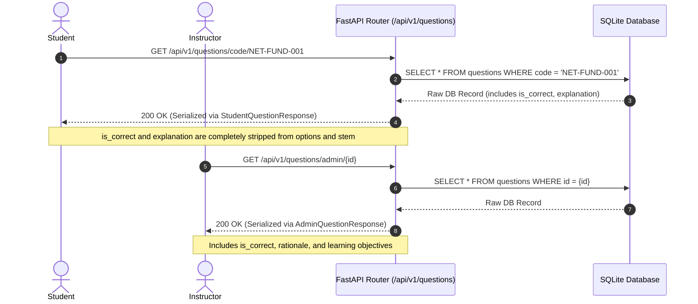

# NexoraNet Question Bank & Examination Architecture

> **Document Version:** 2.0.0 (Step 6 Complete)  
> **Core Engine Services:** `app/services/question_validator.py`, `app/services/question_importer.py`, `app/services/question_bank_service.py`  
> **Database Revision:** `e48d3c51b921` (`code` column on `questions` table)  
> **Security Policy:** Server-Side Answer Shielding (`StudentQuestionResponse`) with Zero Client-Side Answer Leakage

---

## 1. Overview & Scale

The NexoraNet Question Bank provides a large, structured, production-ready assessment repository designed to evaluate foundational computer networking concepts through advanced cybersecurity, packet dissection, and SOC analyst diagnostic competencies.

### Current Inventory Overview

| Category | Beginner | Intermediate | Advanced | Total Questions |
| :--- | :---: | :---: | :---: | :---: |
| **Imported Bank (Step 6)** | 150 | 166 | 170 | **486** |
| **Legacy Seed Questions** | 26 | 15 | 4 | **45** |
| **Total Active Database** | **176** | **182** | **173** | **531** |

### Cognitive Level Distribution (Bloom's Taxonomy)

* **`REMEMBER`**: 132 questions (24.9%) — foundational protocol numbers, standard ports, RFC specifications, frame formats.
* **`UNDERSTAND`**: 255 questions (48.0%) — protocol mechanics, 3-way handshakes, routing logic, defense behaviors.
* **`APPLY`**: 78 questions (14.7%) — subnetting calculations, troubleshooting scenarios, tool execution (`ping`, `traceroute`, `dig`).
* **`ANALYZE`**: 66 questions (12.4%) — hex packet dissection, state exhaustion analysis, alert triage, incident investigation.

---

## 2. Question Bank File Hierarchy

The question repository is partitioned into JSON catalog files located in `backend/data/question_bank/`:

```
backend/data/question_bank/
├── beginner/
│   ├── networking_fundamentals.json       (30 questions: NET-FUND-001 to 030)
│   ├── osi_and_tcpip_layers.json          (30 questions: OSI-001 to 030)
│   ├── ipv4_and_mac_addressing.json       (30 questions: IPV4-001 to 030)
│   ├── ports_and_protocols.json           (35 questions: PORT-001 to 035)
│   └── devices_and_basic_security.json    (25 questions: DEV-SEC-001 to 025)
├── intermediate/
│   ├── subnetting_and_cidr.json           (35 questions: SUBNET-001 to 035)
│   ├── tcp_udp_and_transport.json         (35 questions: TCP-001 to 035)
│   ├── dns_dhcp_and_application.json      (30 questions: APP-001 to 030)
│   ├── routing_and_switching.json         (35 questions: ROUT-001 to 035)
│   └── firewalls_nat_and_troubleshooting.json (31 questions: FW-001 to 031)
└── advanced/
    ├── packet_analysis_and_traffic.json   (35 questions: PCAP-001 to 035)
    ├── network_security_and_defense.json  (35 questions: SEC-DEF-001 to 035)
    ├── reconnaissance_and_scanning_detection.json (30 questions: RECON-001 to 030)
    ├── detection_engineering_and_indicators.json (35 questions: DET-001 to 035)
    └── incident_investigation_and_soc.json (35 questions: SOC-001 to 035)
```

---

## 3. Stable Question Code Taxonomy

Every question in the bank possesses a globally unique, human-readable stable code prefix:

| Prefix | Domain / Module | Tier |
| :--- | :--- | :--- |
| `NET-FUND` | Networking Fundamentals, LAN/WAN, Topologies | Beginner |
| `OSI` | OSI 7 Layers, TCP/IP Model, Encapsulation | Beginner |
| `IPV4` | IPv4 Basics, Classes, Addressing, MAC Addresses | Beginner |
| `PORT` | Transport Ports & Standard Protocols (HTTP, SSH, DNS, etc.) | Beginner |
| `DEV-SEC` | Network Devices, Segmentation, Firewalls, Threat Basics | Beginner |
| `SUBNET` | Subnetting, CIDR, VLSM, Host/Network Calculations | Intermediate |
| `TCP` | TCP Flags, 3-Way Handshake, Teardown, UDP, Sockets | Intermediate |
| `APP` | DNS Resolution, DHCP DORA, HTTP/HTTPS, TLS | Intermediate |
| `ROUT` | Layer 2 Switching, MAC Table, VLANs, Dynamic Routing | Intermediate |
| `FW` | NAT/PAT, ACL Rule Evaluation, Ping, Traceroute, Netstat | Intermediate |
| `PCAP` | Packet Headers, Wireshark Filters, TCP Streams, Hex Dumps | Advanced |
| `SEC-DEF` | Private VLANs, Stateful Firewalls, NIDS/NIPS, NGFW | Advanced |
| `RECON` | Port Scans (SYN, FIN, Xmas), OS Fingerprinting, Recon Defense | Advanced |
| `DET` | Snort/Suricata Rules, IoCs, Network Baselines, Tuning | Advanced |
| `SOC` | Alert Triage, True/False Positives, PCAP Incident Response | Advanced |

---

## 4. Question Validation & Quality Assurance

All questions are audited by `app/services/question_validator.py` (`QuestionValidator`), enforcing:

1. **Taxonomic Integrity:** Ensures `difficulty` (`BEGINNER`, `INTERMEDIATE`, `ADVANCED`) and `cognitive_level` (`REMEMBER`, `UNDERSTAND`, `APPLY`, `ANALYZE`) are valid enums.
2. **Curriculum Mapping:** Maps questions to verified curriculum topic IDs or slugs (`valid_topic_slugs`).
3. **Single Choice Rule:** Exactly one option must have `is_correct == True`.
4. **Multiple Choice Rule:** At least one option must have `is_correct == True`.
5. **True / False Rule:** Exactly 2 options; exactly one correct.
6. **Programmatic IPv4 Subnetting Verification:** Subnet calculations are verified against Python standard library `ipaddress.IPv4Network(..., strict=False)`, ensuring network addresses, broadcast addresses, subnet masks, first/last usable hosts, and usable host counts are mathematically 100% accurate.
7. **Cross-Site Scripting (XSS) Sanitization:** Strips `<script>` tags, dangerous `javascript:` URIs, and inline event handlers (`onload=`, `onerror=`) from stems and explanations.
8. **Duplicate Detection:** Audits duplicate codes and normalized question texts (stripping punctuation, lowercasing, collapsing whitespaces).

---

## 5. Idempotent Import System

Questions are imported via `app/services/question_importer.py` (`QuestionImporter`) or CLI `scripts/import_questions.py`:

```bash
# Dry run verification (does not modify database)
python scripts/import_questions.py --dry-run

# Live database synchronization
python scripts/import_questions.py
```

### Idempotency Guarantee
When `QuestionImporter` executes:
* Questions are looked up by unique `code`.
* If a question already exists, its text, explanation, points, difficulty, and options are updated **in place**.
* Existing question IDs and foreign keys remain preserved, preventing orphaned student attempts or mock test links.
* If a question does not exist, it is created.
* Re-running the script immediately outputs `Created: 0, Updated: 486`, with zero duplicate records created.

---

## 6. Server-Side Student Answer Shielding

Student exam security is enforced strictly at the database serialization boundary:



---

## 7. REST API Endpoints

| Method | Path | Access | Description |
| :--- | :--- | :--- | :--- |
| `GET` | `/api/v1/questions/statistics` | Public | Aggregated counts by difficulty, cognitive level, type, status, and topics |
| `GET` | `/api/v1/questions/code/{code}` | Student | Fetch published question by stable code (shielded) |
| `GET` | `/api/v1/questions/{id}` | Student | Fetch published question by numeric ID (shielded) |
| `GET` | `/api/v1/questions` | Student | Filter questions by topic, difficulty, cognitive level, or search keyword |
| `GET` | `/api/v1/questions/admin/list` | Admin | Comprehensive list including draft, review, and archived items |
| `GET` | `/api/v1/questions/admin/{id}` | Admin | Full question detail with answer keys and authoring metadata |
| `POST` | `/api/v1/questions/admin/create` | Admin | Author new question with options and tags |
| `PUT` | `/api/v1/questions/admin/{id}` | Admin | Update stem, explanation, points, or choices |
| `PUT/POST` | `/api/v1/questions/admin/{id}/publish` | Admin | Publish question for student access |
| `PUT/POST` | `/api/v1/questions/admin/{id}/archive` | Admin | Archive question (hides from student endpoints) |

---

## 8. Integration with Mock Test Engine (Step 5)

The Step 6 question bank powers Step 5's `TestGenerationService`. All seeded test blueprints (`CCNA Network Fundamentals Blueprint` and `Cyber Defense & Packet Forensics Blueprint`) validate as `is_sufficient: True` against the question bank without shortfall.
